# Smart Home Hub

[](https://github.com/Bramvzw/smart-home-hub/actions/workflows/ci.yml)
[](LICENSE)


> 🚧 **Work in progress** — this is an actively developed personal project; modules and APIs are still evolving.

**The self-hosted dashboard that actually does things.**

Most self-hosted dashboards are launchpads: tiles, links and status widgets. This one is an actuator — it dims the lights when rain is coming, drives Spotify playback, tracks prices and pings you on drops, plans your week around your real calendar, turns supermarket offers into a weekly menu, and opens every day with an AI-composed briefing. Built with Laravel as a strict modular monolith, running on a Synology NAS with a Raspberry Pi kiosk as its display.

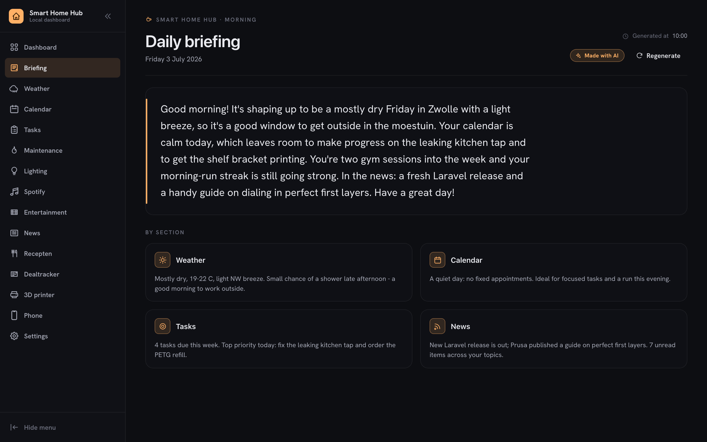

## Why another dashboard?

Homepage, Dashy and Heimdall are excellent launchpads. This project is a different animal: its modules share one domain model, so they **compose** —

- A rainy forecast can flip the living room to a cozy lighting scene (Weather → Lighting).
- Supermarket offers become an AI-generated weekly menu, cross-matched against the deals you already track (Deals → Recipes).
- Concerts get flagged when the artist is already in your Spotify library (Spotify → Entertainment).
- Weather, agenda, tasks, news, price drops and even 3D-print filament stock merge into one morning briefing (everything → Briefing).

A widget grid can't do that — widgets don't know about each other.

The briefing is the flagship: every module can contribute a `BriefingSource`, and Claude (via [Prism](https://prismphp.com)) composes those into a few conversational sentences each morning. A deterministic fallback keeps the briefing working when no AI is configured.

## Modules

| Module | What it does |
|---|---|
| **Briefing** | AI-composed morning briefing aggregating weather, agenda, tasks, news, deals, 3D-print stock and more — with a deterministic fallback when AI is unavailable |
| **Calendar** | Google Calendar agenda plus an AI weekly planner that proposes time blocks around your existing appointments |
| **Tasks** | Local Kanban boards with labels, recurring maintenance tasks and habit streak tracking |
| **Lighting** | Tuya (Calex) & Govee lamp control with deterministic presets and optional weather-triggered scenes (rain → cozy) |
| **Spotify** | Playback control, queue, device transfer, search and library |
| **Entertainment** | Upcoming concerts (Ticketmaster, Bandsintown, venue scrapers), films (TMDB) and new music releases — flagged when already in your Spotify library |
| **Recipes** | AI-generated weekly menu based on current supermarket offers, with per-recipe savings matched against tracked deals |
| **Deals** | Price tracking across bol.com, Amazon and Tweakers with ntfy push alerts on drops |
| **News** | RSS/Atom feeds grouped by topic, with keyword alerts |
| **Weather** | Open-Meteo forecast with rain, wind and daily-summary notifications |
| **Printer** | Bambu Lab filament & parts inventory with low-stock reminders |
| **PhonePing** | Ring your phone through ntfy when it's lost in the house |
| **Settings** | Central settings page — modules expose their own configuration schema |

| | |
|---|---|
| 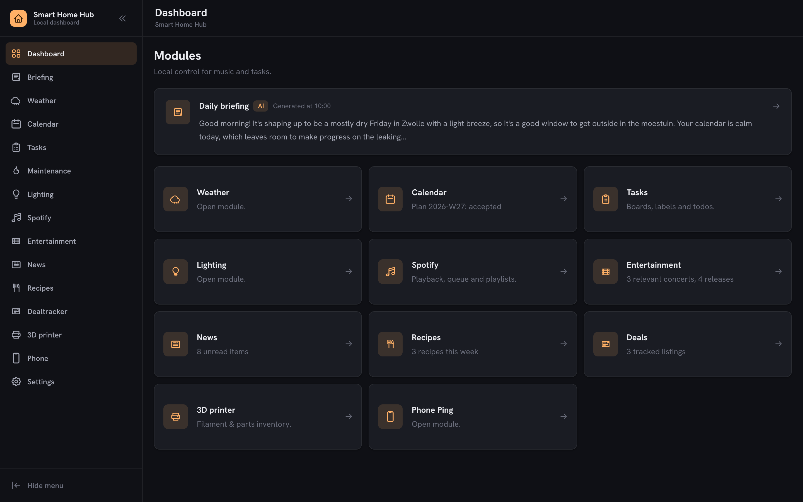 | 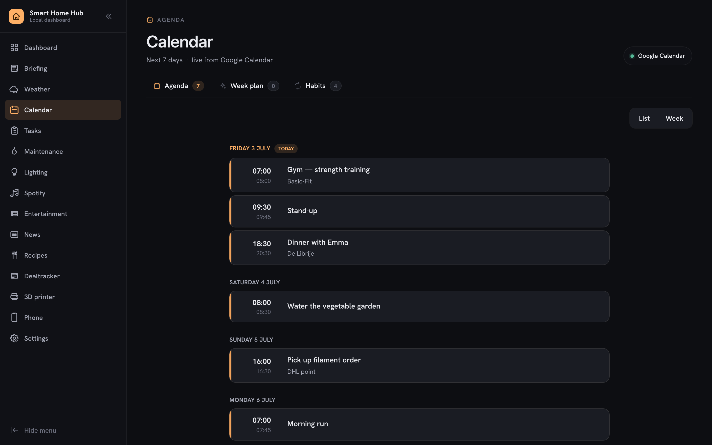 |
| 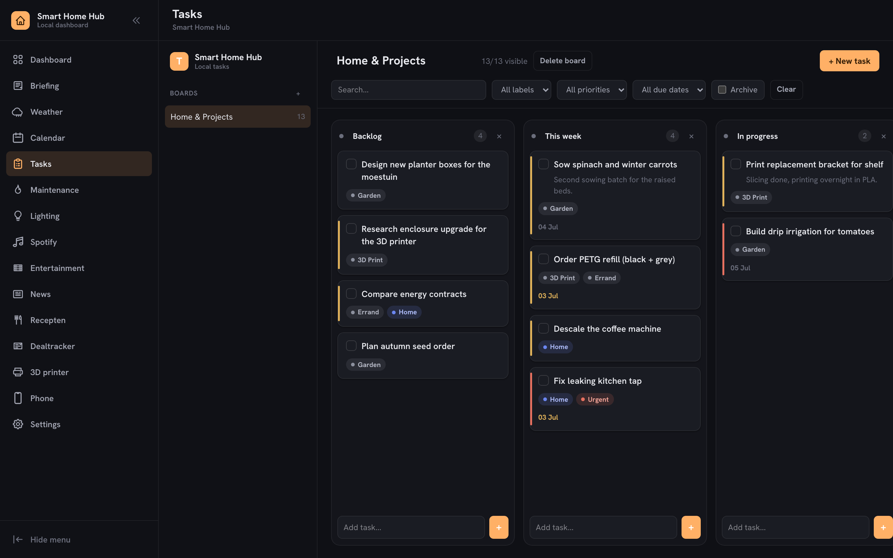 | 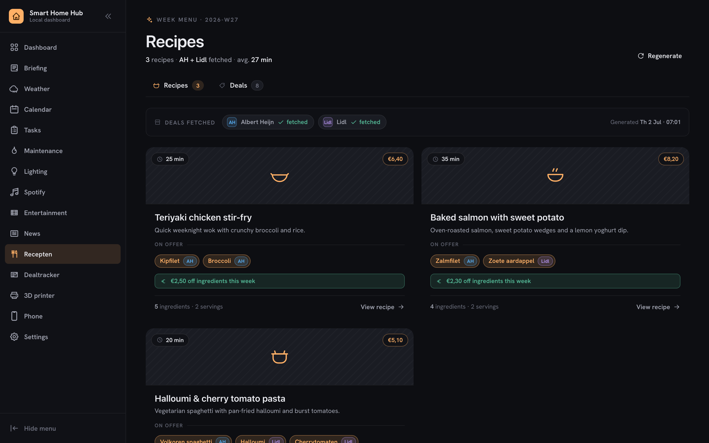 |
| 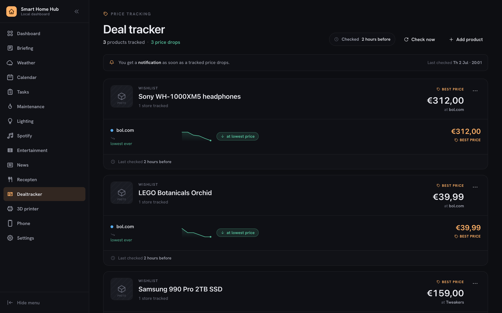 | 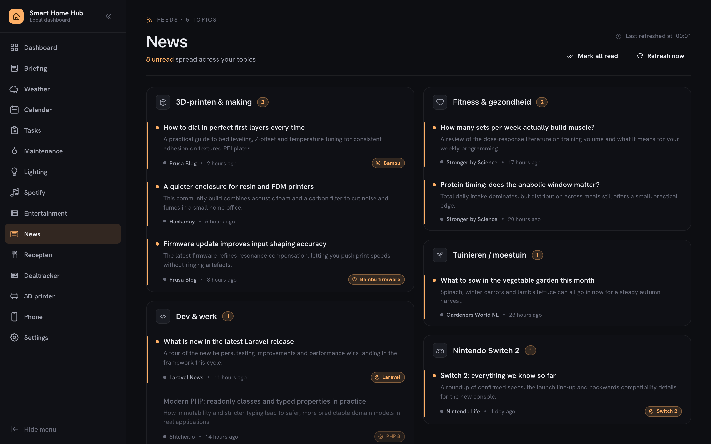 |
| 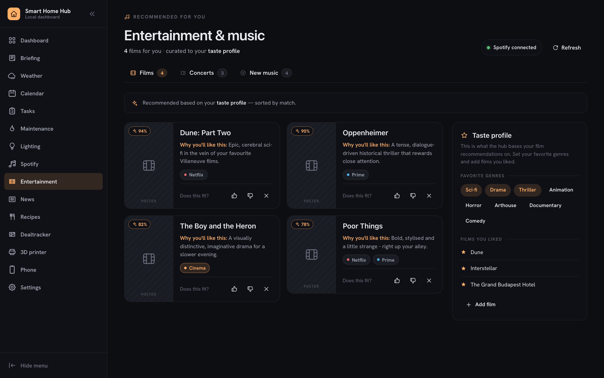 | 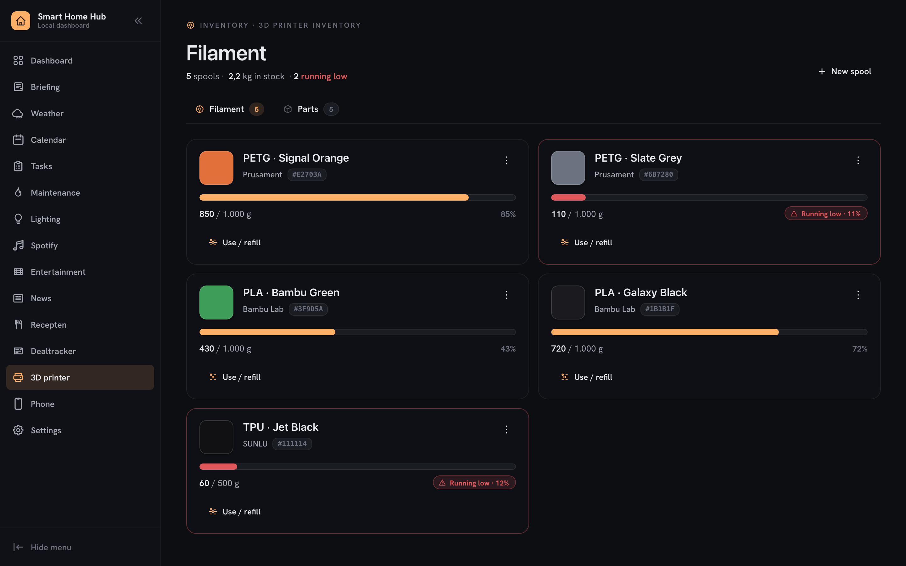 |
| 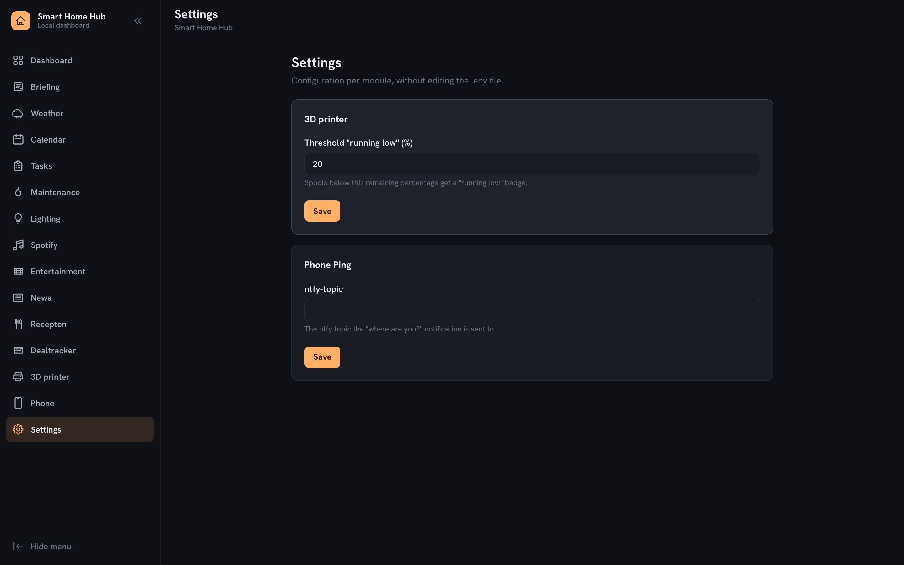 | 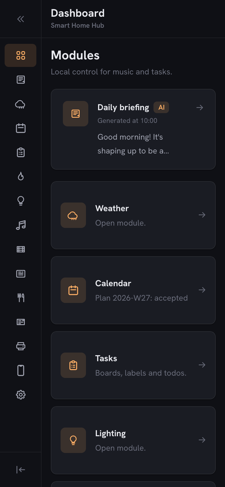 |

## Architecture

The project is a **modular monolith** ([nwidart/laravel-modules](https://github.com/nWidart/laravel-modules)): every feature lives in its own module under `Modules/`, with a shared contract layer in `app/` for cross-module concerns (briefing sources, schedulable goals, health checks, notifications, settings).

```
Modules/{Module}/
├── Actions/          # business use cases (writes)
├── Services/         # external integrations (HTTP clients, token stores)
├── Data/             # DTOs
├── Models/           # Eloquent + query builders
├── Http/             # thin controllers, form requests, resources
├── View/ViewModels/  # read-side page models
├── Briefing/         # this module's contribution to the morning briefing
└── tests/            # module-scoped Feature + Unit tests
```

Integrations are pluggable adapters behind contracts — lights implement `LightProvider` (Tuya, Govee), retailers implement `RetailerAdapter` (bol, Amazon, Tweakers), concert sources implement `ConcertProvider`, and supermarket offers are tagged providers. Adding your own is a small class plus a config entry.

The architecture rules live in [AGENTS.md](AGENTS.md); the documentation vault starts at [docs/vault/README.md](docs/vault/README.md).

**Stack:** Laravel 12 · Livewire · Blade · Vite · SQLite · [Prism](https://prismphp.com) (Anthropic) · Docker on Synology · Raspberry Pi kiosk frontend

## Getting started

```bash
git clone https://github.com/Bramvzw/smart-home-hub.git
cd smart-home-hub
composer install && npm install
cp .env.example .env && php artisan key:generate
touch database/database.sqlite && php artisan migrate
composer dev   # serves app + queue + logs + vite in one command
```

Each integration (Spotify, Google Calendar, Tuya, Govee, TMDB, Anthropic, ntfy) is optional and configured through `.env` — see `.env.example`. Modules degrade gracefully when their integration isn't configured.

## Security

The hub is LAN-first by design: a private-network guard (on by default) rejects requests from outside your configured CIDRs, and optional HTTP Basic Auth adds a second layer for untrusted networks. See [SECURITY.md](SECURITY.md) for the deployment model, hardening guidance and how to report vulnerabilities.

## Testing

```bash
composer test   # PHPUnit — all module Feature + Unit suites
npm test        # Jest — module frontend specs
```

## Deployment

Deploys to a Synology NAS via a single command (`make release`): builds assets, syncs the release over SSH and restarts the Docker stack. See [docs/vault/Setup](docs/vault/Setup) for NAS and Raspberry Pi kiosk setup.

## License

[MIT](LICENSE)
